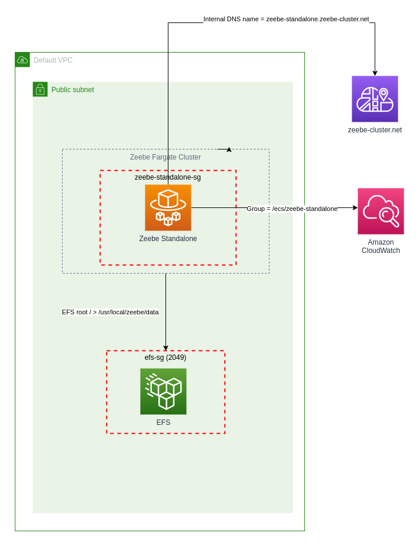

# Zeebe CDK Constructs

This is a library of CDK constructs and patterns for deploying the Camunda Zeebe workflow engine on AWS.

[](https://constructs.dev/packages/zeebe-cdk-constructs)

## Standalone Fargate



`ZeebeStandaloneFargateCluster` creates a single Zeebe instance that is configured as both gateway and broker, deployed
as Fargate service in a public subnet. With some additonal configuration data can be stored on EFS and the Simple
Monitor application can be co-deployed.

With the default configuration settings, the following infrastructure will be created on AWS:

* A vpc is required - default VPC can be used
* ECS Cluster - zeebe-standalone
* 1 Fargate task is created with 0.5 cpu and 1024 memory
* 1 Zeebe gateway/broker in a public subnet (Public IP4)
* Zeebe node is configured as a Fargate task definition and service
* Ephemeral task storage is mounted at /usr/local/zeebe/data (EFS is an option for persistent storage)

Note that a public subnet is used to make the initial setup and verification easier. You should secure the environment
with an appropriate security group configuration and/or move the deployment into a private vpc subnet.

```typescript

import * as cdk from 'aws-cdk-lib';
import {Construct} from 'constructs';
import {ZeebeStandaloneFargateCluster} from "zeebe-cdk-constructs";

export class ZeebeStandaloneFargateStack extends cdk.Stack {

    constructor(scope: Construct, id: string, props?: cdk.StackProps) {
        super(scope, id, props);

        let vpc = Vpc.fromLookup(this, 'my-vpc', {isDefault: true})

        new ZeebeStandaloneFargateCluster(this, 'ZeebeStandalone', {
            vpc: vpc,
            //
            // publicGateway: false, // Deploy the gateway in a private subnet
            // Optional - EFS for persistent storage
            //fileSystem: new FileSystem(this, 'zeebe-efs', { vpc: vpc })
        });
    }
}

```

## Deploying Simple Monitor with Zeebe

The Simple monitor application can be deployed alongside the Zeebe instance using the configuration below.

* A custom Zeebe image that includes the Hazelcast exporter will be built and stored in ECR of the AWS account.
* This configuration will create a larger Fargate task using 2Gb of memory - split evenly between the Zeebe and Simple
  Monitor containers

```typescript

import * as cdk from 'aws-cdk-lib';
import {Construct} from 'constructs';
import {ZeebeStandaloneFargateCluster} from "zeebe-cdk-constructs";

export class ZeebeStandaloneFargateStack extends cdk.Stack {

    constructor(scope: Construct, id: string, props?: cdk.StackProps) {
        super(scope, id, props);

        new ZeebeStandaloneFargateCluster(this, 'ZeebeStandaloneWithSimpleMonitor', {
            simpleMonitor: true,
            hazelcastExporter: true
        });
    }
}

```

## Zeebe Fargate Cluster


The `ZeebeFargateCluster` will create the following infrastructure on AWS

With the default configuration, the following infrastructure will be created on AWS:

* New VPC on CIDR 10.0.0.0/16
* 1 NAT Gateway
* 3 Zeebe brokers in a private subnet (IP4)
* 1 Zeebe gateway in a public subnet (Public IP4)
* ECS Cluster
* Each Zeebe node is configured as a Fargate service
* Each Zeebe Fargate task is assigned 0.5 cpu and 1024 memory
* Cloud Map for internal DNS _zeebe-cluster.net_
* EFS with mount points for Zeebe data storage

Using the properties object you can customise the VPC settings, ECS cluster, security groups and Zeebe properties

```typescript
import * as cdk from 'aws-cdk-lib';
import {Construct} from 'constructs';
import {ZeebeFargateCluster} from "zeebe-cdk-constructs";


export class ZeebeFargateClusterStack extends cdk.Stack {

    constructor(scope: Construct, id: string, props?: cdk.StackProps) {
        super(scope, id, props);

        new ZeebeFargateCluster(this, 'ZeebeCluster', {
            // cpu: 512,                //Broker task cpu
            // memory: 1024,            //Broker task memory
            // gatewayCpu: 512,
            // gatewayMemory: 1024,
        });
    }
}

```

### Customise Cluster Settings

```typescript
export class ZeebeFargateClusterStack extends cdk.Stack {

    constructor(scope: Construct, id: string, props?: cdk.StackProps) {
        super(scope, id, props);

        const myCustomVpc = Vpc.fromLookup(this, 'default', {vpcName: 'my-custom-vpc', vpcId: '1234'})

        new ZeebeFargateCluster(this, 'ZeebeCluster', {
            vpc: myCustomVpc,
            publicGateway: false //keep gateway internal, may need a vpn or bastion/jump server for access
        });
    }
}

```

## Camunda Core Simple


A construct pattern to create a Camunda 8 cluster comprising of Zeebe, Operate, Tasklist and Elasticsearch deployed on
AWS ECS Fargate.

The simple version creates all components within a single Fargate task definition and service. This simplifies the
networking as each component can refer to other components using localhost/127.0.0.1 (instead of Cloud Map service
discovery) - this approach is also cheaper. The drawback is a lack resilience as if one component fails, then the entire
task may need to be restarted, which will restart all components, as this construct is best used to spin up development
or testing environments

* Fargate task containing Zeebe, Operate, Tasklist, Elasticsearch
* The Fargate task by default is assigned 3gb memory and 1 cpu

```typescript
export class CamundaCoreSimpleStack extends cdk.Stack {

    constructor(scope: Construct, id: string, props?: cdk.StackProps) {
        super(scope, id, props);

        //This will create a new VPC and ECS cluster
        new CamundaPlatformCoreSimple(this, 'camunda-simple-fargate', {useEfsStorage: true});
    }
}
```

## Camunda Core (experimental - work in progress)

Deploys Zeebe, Camunda Operate, Camunda This construct aims to deploy the equivalent components of the camunda core
docker compose file on AWS Fargate.

* New VPC on CIDR 10.0.0.0/16
* 1 NAT Gateway
* 3 Zeebe brokers in a private subnet
* 1 Zeebe gateway is in a public subnet
* ECS Cluster
* Each Zeebe node is configured as a Fargate service
* Cloud Map for internal DNS _zeebe-cluster.net_
* EFS with mount points for Zeebe data storage

```typescript
export class CamundaCoreStack extends cdk.Stack {

    constructor(scope: Construct, id: string, props?: cdk.StackProps) {
        super(scope, id, props);

        const myCustomVpc = Vpc.fromLookup(this, 'default', {vpcName: 'my-custom-vpc', vpcId: '1234'})

        new CamundaPlatformCoreFargate(this, 'camunda-core', {
            vpc: myCustomVpc,
            publicGateway: false //keep gateway internal, may need a vpn or bastion/jump server for access
        });
        //loadbalancer url for tasklist and operate will be available as an output
    }
}
```


# API Reference <a name="API Reference" id="api-reference"></a>

## Constructs <a name="Constructs" id="Constructs"></a>

### CamundaPlatformCoreFargate <a name="CamundaPlatformCoreFargate" id="zeebe-cdk-constructs.CamundaPlatformCoreFargate"></a>

A construct pattern to create a Camunda 8 cluster comprising of Zeebe, Operate, Tasklist and Elasticsearch deployed on AWS ECS Fargate with an application loadbalancer allowing http access to Operate and Tasklist.

#### Initializers <a name="Initializers" id="zeebe-cdk-constructs.CamundaPlatformCoreFargate.Initializer"></a>

```typescript
import { CamundaPlatformCoreFargate } from 'zeebe-cdk-constructs'

new CamundaPlatformCoreFargate(scope: Construct, id: string, properties: CamundaPlatformProps)
```

| **Name** | **Type** | **Description** |
| --- | --- | --- |
| <code><a href="#zeebe-cdk-constructs.CamundaPlatformCoreFargate.Initializer.parameter.scope">scope</a></code> | <code>constructs.Construct</code> | *No description.* |
| <code><a href="#zeebe-cdk-constructs.CamundaPlatformCoreFargate.Initializer.parameter.id">id</a></code> | <code>string</code> | *No description.* |
| <code><a href="#zeebe-cdk-constructs.CamundaPlatformCoreFargate.Initializer.parameter.properties">properties</a></code> | <code><a href="#zeebe-cdk-constructs.CamundaPlatformProps">CamundaPlatformProps</a></code> | *No description.* |

---

##### `scope`<sup>Required</sup> <a name="scope" id="zeebe-cdk-constructs.CamundaPlatformCoreFargate.Initializer.parameter.scope"></a>

- *Type:* constructs.Construct

---

##### `id`<sup>Required</sup> <a name="id" id="zeebe-cdk-constructs.CamundaPlatformCoreFargate.Initializer.parameter.id"></a>

- *Type:* string

---

##### `properties`<sup>Required</sup> <a name="properties" id="zeebe-cdk-constructs.CamundaPlatformCoreFargate.Initializer.parameter.properties"></a>

- *Type:* <a href="#zeebe-cdk-constructs.CamundaPlatformProps">CamundaPlatformProps</a>

---

#### Methods <a name="Methods" id="Methods"></a>

| **Name** | **Description** |
| --- | --- |
| <code><a href="#zeebe-cdk-constructs.CamundaPlatformCoreFargate.toString">toString</a></code> | Returns a string representation of this construct. |

---

##### `toString` <a name="toString" id="zeebe-cdk-constructs.CamundaPlatformCoreFargate.toString"></a>

```typescript
public toString(): string
```

Returns a string representation of this construct.

#### Static Functions <a name="Static Functions" id="Static Functions"></a>

| **Name** | **Description** |
| --- | --- |
| <code><a href="#zeebe-cdk-constructs.CamundaPlatformCoreFargate.isConstruct">isConstruct</a></code> | Checks if `x` is a construct. |

---

##### ~~`isConstruct`~~ <a name="isConstruct" id="zeebe-cdk-constructs.CamundaPlatformCoreFargate.isConstruct"></a>

```typescript
import { CamundaPlatformCoreFargate } from 'zeebe-cdk-constructs'

CamundaPlatformCoreFargate.isConstruct(x: any)
```

Checks if `x` is a construct.

###### `x`<sup>Required</sup> <a name="x" id="zeebe-cdk-constructs.CamundaPlatformCoreFargate.isConstruct.parameter.x"></a>

- *Type:* any

Any object.

---

#### Properties <a name="Properties" id="Properties"></a>

| **Name** | **Type** | **Description** |
| --- | --- | --- |
| <code><a href="#zeebe-cdk-constructs.CamundaPlatformCoreFargate.property.node">node</a></code> | <code>constructs.Node</code> | The tree node. |

---

##### `node`<sup>Required</sup> <a name="node" id="zeebe-cdk-constructs.CamundaPlatformCoreFargate.property.node"></a>

```typescript
public readonly node: Node;
```

- *Type:* constructs.Node

The tree node.

---


### ZeebeFargateCluster <a name="ZeebeFargateCluster" id="zeebe-cdk-constructs.ZeebeFargateCluster"></a>

A construct to create a Zeebe cluster on AWS Fargate.

#### Initializers <a name="Initializers" id="zeebe-cdk-constructs.ZeebeFargateCluster.Initializer"></a>

```typescript
import { ZeebeFargateCluster } from 'zeebe-cdk-constructs'

new ZeebeFargateCluster(scope: Construct, id: string, zeebeProperties: ZeebeClusterProps)
```

| **Name** | **Type** | **Description** |
| --- | --- | --- |
| <code><a href="#zeebe-cdk-constructs.ZeebeFargateCluster.Initializer.parameter.scope">scope</a></code> | <code>constructs.Construct</code> | CDK scope. |
| <code><a href="#zeebe-cdk-constructs.ZeebeFargateCluster.Initializer.parameter.id">id</a></code> | <code>string</code> | CDK id. |
| <code><a href="#zeebe-cdk-constructs.ZeebeFargateCluster.Initializer.parameter.zeebeProperties">zeebeProperties</a></code> | <code><a href="#zeebe-cdk-constructs.ZeebeClusterProps">ZeebeClusterProps</a></code> | Zeebe cluster properties. |

---

##### `scope`<sup>Required</sup> <a name="scope" id="zeebe-cdk-constructs.ZeebeFargateCluster.Initializer.parameter.scope"></a>

- *Type:* constructs.Construct

CDK scope.

---

##### `id`<sup>Required</sup> <a name="id" id="zeebe-cdk-constructs.ZeebeFargateCluster.Initializer.parameter.id"></a>

- *Type:* string

CDK id.

---

##### `zeebeProperties`<sup>Required</sup> <a name="zeebeProperties" id="zeebe-cdk-constructs.ZeebeFargateCluster.Initializer.parameter.zeebeProperties"></a>

- *Type:* <a href="#zeebe-cdk-constructs.ZeebeClusterProps">ZeebeClusterProps</a>

Zeebe cluster properties.

---

#### Methods <a name="Methods" id="Methods"></a>

| **Name** | **Description** |
| --- | --- |
| <code><a href="#zeebe-cdk-constructs.ZeebeFargateCluster.toString">toString</a></code> | Returns a string representation of this construct. |

---

##### `toString` <a name="toString" id="zeebe-cdk-constructs.ZeebeFargateCluster.toString"></a>

```typescript
public toString(): string
```

Returns a string representation of this construct.

#### Static Functions <a name="Static Functions" id="Static Functions"></a>

| **Name** | **Description** |
| --- | --- |
| <code><a href="#zeebe-cdk-constructs.ZeebeFargateCluster.isConstruct">isConstruct</a></code> | Checks if `x` is a construct. |

---

##### ~~`isConstruct`~~ <a name="isConstruct" id="zeebe-cdk-constructs.ZeebeFargateCluster.isConstruct"></a>

```typescript
import { ZeebeFargateCluster } from 'zeebe-cdk-constructs'

ZeebeFargateCluster.isConstruct(x: any)
```

Checks if `x` is a construct.

###### `x`<sup>Required</sup> <a name="x" id="zeebe-cdk-constructs.ZeebeFargateCluster.isConstruct.parameter.x"></a>

- *Type:* any

Any object.

---

#### Properties <a name="Properties" id="Properties"></a>

| **Name** | **Type** | **Description** |
| --- | --- | --- |
| <code><a href="#zeebe-cdk-constructs.ZeebeFargateCluster.property.node">node</a></code> | <code>constructs.Node</code> | The tree node. |

---

##### `node`<sup>Required</sup> <a name="node" id="zeebe-cdk-constructs.ZeebeFargateCluster.property.node"></a>

```typescript
public readonly node: Node;
```

- *Type:* constructs.Node

The tree node.

---


### ZeebeStandaloneFargateCluster <a name="ZeebeStandaloneFargateCluster" id="zeebe-cdk-constructs.ZeebeStandaloneFargateCluster"></a>

A construct to create a single standalone Zeebe container (gateway and broker) deployed on AWS Fargate.

#### Initializers <a name="Initializers" id="zeebe-cdk-constructs.ZeebeStandaloneFargateCluster.Initializer"></a>

```typescript
import { ZeebeStandaloneFargateCluster } from 'zeebe-cdk-constructs'

new ZeebeStandaloneFargateCluster(scope: Construct, id: string, zeebeProperties: ZeebeStandaloneProps)
```

| **Name** | **Type** | **Description** |
| --- | --- | --- |
| <code><a href="#zeebe-cdk-constructs.ZeebeStandaloneFargateCluster.Initializer.parameter.scope">scope</a></code> | <code>constructs.Construct</code> | *No description.* |
| <code><a href="#zeebe-cdk-constructs.ZeebeStandaloneFargateCluster.Initializer.parameter.id">id</a></code> | <code>string</code> | *No description.* |
| <code><a href="#zeebe-cdk-constructs.ZeebeStandaloneFargateCluster.Initializer.parameter.zeebeProperties">zeebeProperties</a></code> | <code><a href="#zeebe-cdk-constructs.ZeebeStandaloneProps">ZeebeStandaloneProps</a></code> | *No description.* |

---

##### `scope`<sup>Required</sup> <a name="scope" id="zeebe-cdk-constructs.ZeebeStandaloneFargateCluster.Initializer.parameter.scope"></a>

- *Type:* constructs.Construct

---

##### `id`<sup>Required</sup> <a name="id" id="zeebe-cdk-constructs.ZeebeStandaloneFargateCluster.Initializer.parameter.id"></a>

- *Type:* string

---

##### `zeebeProperties`<sup>Required</sup> <a name="zeebeProperties" id="zeebe-cdk-constructs.ZeebeStandaloneFargateCluster.Initializer.parameter.zeebeProperties"></a>

- *Type:* <a href="#zeebe-cdk-constructs.ZeebeStandaloneProps">ZeebeStandaloneProps</a>

---

#### Methods <a name="Methods" id="Methods"></a>

| **Name** | **Description** |
| --- | --- |
| <code><a href="#zeebe-cdk-constructs.ZeebeStandaloneFargateCluster.toString">toString</a></code> | Returns a string representation of this construct. |

---

##### `toString` <a name="toString" id="zeebe-cdk-constructs.ZeebeStandaloneFargateCluster.toString"></a>

```typescript
public toString(): string
```

Returns a string representation of this construct.

#### Static Functions <a name="Static Functions" id="Static Functions"></a>

| **Name** | **Description** |
| --- | --- |
| <code><a href="#zeebe-cdk-constructs.ZeebeStandaloneFargateCluster.isConstruct">isConstruct</a></code> | Checks if `x` is a construct. |

---

##### ~~`isConstruct`~~ <a name="isConstruct" id="zeebe-cdk-constructs.ZeebeStandaloneFargateCluster.isConstruct"></a>

```typescript
import { ZeebeStandaloneFargateCluster } from 'zeebe-cdk-constructs'

ZeebeStandaloneFargateCluster.isConstruct(x: any)
```

Checks if `x` is a construct.

###### `x`<sup>Required</sup> <a name="x" id="zeebe-cdk-constructs.ZeebeStandaloneFargateCluster.isConstruct.parameter.x"></a>

- *Type:* any

Any object.

---

#### Properties <a name="Properties" id="Properties"></a>

| **Name** | **Type** | **Description** |
| --- | --- | --- |
| <code><a href="#zeebe-cdk-constructs.ZeebeStandaloneFargateCluster.property.node">node</a></code> | <code>constructs.Node</code> | The tree node. |

---

##### `node`<sup>Required</sup> <a name="node" id="zeebe-cdk-constructs.ZeebeStandaloneFargateCluster.property.node"></a>

```typescript
public readonly node: Node;
```

- *Type:* constructs.Node

The tree node.

---


## Structs <a name="Structs" id="Structs"></a>

### CamundaPlatformProps <a name="CamundaPlatformProps" id="zeebe-cdk-constructs.CamundaPlatformProps"></a>

Properties for configuraing the CAmunda Core Platform compoennts.

#### Initializer <a name="Initializer" id="zeebe-cdk-constructs.CamundaPlatformProps.Initializer"></a>

```typescript
import { CamundaPlatformProps } from 'zeebe-cdk-constructs'

const camundaPlatformProps: CamundaPlatformProps = { ... }
```

#### Properties <a name="Properties" id="Properties"></a>

| **Name** | **Type** | **Description** |
| --- | --- | --- |
| <code><a href="#zeebe-cdk-constructs.CamundaPlatformProps.property.ecsCluster">ecsCluster</a></code> | <code>aws-cdk-lib.aws_ecs.ICluster</code> | The ECS cluster to create the Zeebe nodes in. |
| <code><a href="#zeebe-cdk-constructs.CamundaPlatformProps.property.elasticSearchProps">elasticSearchProps</a></code> | <code><a href="#zeebe-cdk-constructs.ElasticsearchProps">ElasticsearchProps</a></code> | Configuration properties for the Elasticsearch node in the camunda cluster. |
| <code><a href="#zeebe-cdk-constructs.CamundaPlatformProps.property.fileSystem">fileSystem</a></code> | <code>aws-cdk-lib.aws_efs.FileSystem</code> | A default EFS will be created if this is not specified Use the fileSystem property to customise a file system. |
| <code><a href="#zeebe-cdk-constructs.CamundaPlatformProps.property.namespace">namespace</a></code> | <code>aws-cdk-lib.aws_servicediscovery.INamespace</code> | A CloudMap private name space to be used for service discovery. |
| <code><a href="#zeebe-cdk-constructs.CamundaPlatformProps.property.operateProps">operateProps</a></code> | <code><a href="#zeebe-cdk-constructs.OperateProps">OperateProps</a></code> | Configuration properties for the Operate node in the camunda cluster. |
| <code><a href="#zeebe-cdk-constructs.CamundaPlatformProps.property.taskListProps">taskListProps</a></code> | <code><a href="#zeebe-cdk-constructs.TaskListProps">TaskListProps</a></code> | Configuration properties for the Tasklist node in the camunda cluster. |
| <code><a href="#zeebe-cdk-constructs.CamundaPlatformProps.property.useEfsStorage">useEfsStorage</a></code> | <code>boolean</code> | If true, store zeebe data on EFS. |
| <code><a href="#zeebe-cdk-constructs.CamundaPlatformProps.property.vpc">vpc</a></code> | <code>aws-cdk-lib.aws_ec2.IVpc</code> | The VPC that the cluster will be created in. |
| <code><a href="#zeebe-cdk-constructs.CamundaPlatformProps.property.zeebeProps">zeebeProps</a></code> | <code><a href="#zeebe-cdk-constructs.ZeebeProps">ZeebeProps</a></code> | Configuration properties for the Zeebe node in the camunda cluster. |

---

##### `ecsCluster`<sup>Optional</sup> <a name="ecsCluster" id="zeebe-cdk-constructs.CamundaPlatformProps.property.ecsCluster"></a>

```typescript
public readonly ecsCluster: ICluster;
```

- *Type:* aws-cdk-lib.aws_ecs.ICluster

The ECS cluster to create the Zeebe nodes in.

If not specified a new ECS cluster will be created called zeebe-cluster.

---

##### `elasticSearchProps`<sup>Optional</sup> <a name="elasticSearchProps" id="zeebe-cdk-constructs.CamundaPlatformProps.property.elasticSearchProps"></a>

```typescript
public readonly elasticSearchProps: ElasticsearchProps;
```

- *Type:* <a href="#zeebe-cdk-constructs.ElasticsearchProps">ElasticsearchProps</a>

Configuration properties for the Elasticsearch node in the camunda cluster.

---

##### `fileSystem`<sup>Optional</sup> <a name="fileSystem" id="zeebe-cdk-constructs.CamundaPlatformProps.property.fileSystem"></a>

```typescript
public readonly fileSystem: FileSystem;
```

- *Type:* aws-cdk-lib.aws_efs.FileSystem

A default EFS will be created if this is not specified Use the fileSystem property to customise a file system.

---

##### `namespace`<sup>Optional</sup> <a name="namespace" id="zeebe-cdk-constructs.CamundaPlatformProps.property.namespace"></a>

```typescript
public readonly namespace: INamespace;
```

- *Type:* aws-cdk-lib.aws_servicediscovery.INamespace

A CloudMap private name space to be used for service discovery.

If not specified a private name space
called camunda-cluster.net will be created.

---

##### `operateProps`<sup>Optional</sup> <a name="operateProps" id="zeebe-cdk-constructs.CamundaPlatformProps.property.operateProps"></a>

```typescript
public readonly operateProps: OperateProps;
```

- *Type:* <a href="#zeebe-cdk-constructs.OperateProps">OperateProps</a>

Configuration properties for the Operate node in the camunda cluster.

---

##### `taskListProps`<sup>Optional</sup> <a name="taskListProps" id="zeebe-cdk-constructs.CamundaPlatformProps.property.taskListProps"></a>

```typescript
public readonly taskListProps: TaskListProps;
```

- *Type:* <a href="#zeebe-cdk-constructs.TaskListProps">TaskListProps</a>

Configuration properties for the Tasklist node in the camunda cluster.

---

##### `useEfsStorage`<sup>Optional</sup> <a name="useEfsStorage" id="zeebe-cdk-constructs.CamundaPlatformProps.property.useEfsStorage"></a>

```typescript
public readonly useEfsStorage: boolean;
```

- *Type:* boolean

If true, store zeebe data on EFS.

When false zeebe data is stored on Fargate ephemereal storage and is lost
when the service is destroyed. Customise the EFS useing the FileSystem property


Default is false

---

##### `vpc`<sup>Optional</sup> <a name="vpc" id="zeebe-cdk-constructs.CamundaPlatformProps.property.vpc"></a>

```typescript
public readonly vpc: IVpc;
```

- *Type:* aws-cdk-lib.aws_ec2.IVpc

The VPC that the cluster will be created in.

If this is not specified, a new VPC will be created on CIDR block 10.0.0.0/16
with a public and private subnet and a single NAT gateway.

---

##### `zeebeProps`<sup>Optional</sup> <a name="zeebeProps" id="zeebe-cdk-constructs.CamundaPlatformProps.property.zeebeProps"></a>

```typescript
public readonly zeebeProps: ZeebeProps;
```

- *Type:* <a href="#zeebe-cdk-constructs.ZeebeProps">ZeebeProps</a>

Configuration properties for the Zeebe node in the camunda cluster.

---

### ElasticsearchProps <a name="ElasticsearchProps" id="zeebe-cdk-constructs.ElasticsearchProps"></a>

#### Initializer <a name="Initializer" id="zeebe-cdk-constructs.ElasticsearchProps.Initializer"></a>

```typescript
import { ElasticsearchProps } from 'zeebe-cdk-constructs'

const elasticsearchProps: ElasticsearchProps = { ... }
```

#### Properties <a name="Properties" id="Properties"></a>

| **Name** | **Type** | **Description** |
| --- | --- | --- |
| <code><a href="#zeebe-cdk-constructs.ElasticsearchProps.property.cpu">cpu</a></code> | <code>number</code> | The amount of cpu to assign to the task. |
| <code><a href="#zeebe-cdk-constructs.ElasticsearchProps.property.environment">environment</a></code> | <code>any</code> | Environment variables to be passed to components docker container. |
| <code><a href="#zeebe-cdk-constructs.ElasticsearchProps.property.image">image</a></code> | <code>aws-cdk-lib.aws_ecs.ContainerImage</code> | Container image for the component. |
| <code><a href="#zeebe-cdk-constructs.ElasticsearchProps.property.memory">memory</a></code> | <code>number</code> | The amount of memory to assign to the task. |
| <code><a href="#zeebe-cdk-constructs.ElasticsearchProps.property.portMappings">portMappings</a></code> | <code>aws-cdk-lib.aws_ecs.PortMapping[]</code> | Override the port mappings of the container. |
| <code><a href="#zeebe-cdk-constructs.ElasticsearchProps.property.securityGroup">securityGroup</a></code> | <code>aws-cdk-lib.aws_ec2.ISecurityGroup</code> | *No description.* |

---

##### `cpu`<sup>Optional</sup> <a name="cpu" id="zeebe-cdk-constructs.ElasticsearchProps.property.cpu"></a>

```typescript
public readonly cpu: number;
```

- *Type:* number

The amount of cpu to assign to the task.

Must be one of the supported Fargate memory configurations. Defaults to 512

---

##### `environment`<sup>Optional</sup> <a name="environment" id="zeebe-cdk-constructs.ElasticsearchProps.property.environment"></a>

```typescript
public readonly environment: any;
```

- *Type:* any

Environment variables to be passed to components docker container.

---

##### `image`<sup>Optional</sup> <a name="image" id="zeebe-cdk-constructs.ElasticsearchProps.property.image"></a>

```typescript
public readonly image: ContainerImage;
```

- *Type:* aws-cdk-lib.aws_ecs.ContainerImage

Container image for the component.

---

##### `memory`<sup>Optional</sup> <a name="memory" id="zeebe-cdk-constructs.ElasticsearchProps.property.memory"></a>

```typescript
public readonly memory: number;
```

- *Type:* number

The amount of memory to assign to the task.

Must be one of the supported Fargate memory configurations. Defaults to 1024

---

##### `portMappings`<sup>Optional</sup> <a name="portMappings" id="zeebe-cdk-constructs.ElasticsearchProps.property.portMappings"></a>

```typescript
public readonly portMappings: PortMapping[];
```

- *Type:* aws-cdk-lib.aws_ecs.PortMapping[]

Override the port mappings of the container.

The default port mappings are 26500, 26501, 26502

---

##### `securityGroup`<sup>Optional</sup> <a name="securityGroup" id="zeebe-cdk-constructs.ElasticsearchProps.property.securityGroup"></a>

```typescript
public readonly securityGroup: ISecurityGroup;
```

- *Type:* aws-cdk-lib.aws_ec2.ISecurityGroup

---

### GlobalProps <a name="GlobalProps" id="zeebe-cdk-constructs.GlobalProps"></a>

#### Initializer <a name="Initializer" id="zeebe-cdk-constructs.GlobalProps.Initializer"></a>

```typescript
import { GlobalProps } from 'zeebe-cdk-constructs'

const globalProps: GlobalProps = { ... }
```

#### Properties <a name="Properties" id="Properties"></a>

| **Name** | **Type** | **Description** |
| --- | --- | --- |
| <code><a href="#zeebe-cdk-constructs.GlobalProps.property.containerImage">containerImage</a></code> | <code>aws-cdk-lib.aws_ecs.ContainerImage</code> | Using this property you can specify a custom container image from a custom registry. |

---

##### `containerImage`<sup>Optional</sup> <a name="containerImage" id="zeebe-cdk-constructs.GlobalProps.property.containerImage"></a>

```typescript
public readonly containerImage: ContainerImage;
```

- *Type:* aws-cdk-lib.aws_ecs.ContainerImage

Using this property you can specify a custom container image from a custom registry.

Defaults to camunda/zeebe:latest from Docker hub if not set.

---

### OperateProps <a name="OperateProps" id="zeebe-cdk-constructs.OperateProps"></a>

#### Initializer <a name="Initializer" id="zeebe-cdk-constructs.OperateProps.Initializer"></a>

```typescript
import { OperateProps } from 'zeebe-cdk-constructs'

const operateProps: OperateProps = { ... }
```

#### Properties <a name="Properties" id="Properties"></a>

| **Name** | **Type** | **Description** |
| --- | --- | --- |
| <code><a href="#zeebe-cdk-constructs.OperateProps.property.cpu">cpu</a></code> | <code>number</code> | The amount of cpu to assign to the task. |
| <code><a href="#zeebe-cdk-constructs.OperateProps.property.environment">environment</a></code> | <code>any</code> | Environment variables to be passed to components docker container. |
| <code><a href="#zeebe-cdk-constructs.OperateProps.property.image">image</a></code> | <code>aws-cdk-lib.aws_ecs.ContainerImage</code> | Container image for the component. |
| <code><a href="#zeebe-cdk-constructs.OperateProps.property.memory">memory</a></code> | <code>number</code> | The amount of memory to assign to the task. |
| <code><a href="#zeebe-cdk-constructs.OperateProps.property.portMappings">portMappings</a></code> | <code>aws-cdk-lib.aws_ecs.PortMapping[]</code> | Override the port mappings of the container. |
| <code><a href="#zeebe-cdk-constructs.OperateProps.property.securityGroup">securityGroup</a></code> | <code>aws-cdk-lib.aws_ec2.ISecurityGroup</code> | *No description.* |

---

##### `cpu`<sup>Optional</sup> <a name="cpu" id="zeebe-cdk-constructs.OperateProps.property.cpu"></a>

```typescript
public readonly cpu: number;
```

- *Type:* number

The amount of cpu to assign to the task.

Must be one of the supported Fargate memory configurations. Defaults to 512

---

##### `environment`<sup>Optional</sup> <a name="environment" id="zeebe-cdk-constructs.OperateProps.property.environment"></a>

```typescript
public readonly environment: any;
```

- *Type:* any

Environment variables to be passed to components docker container.

---

##### `image`<sup>Optional</sup> <a name="image" id="zeebe-cdk-constructs.OperateProps.property.image"></a>

```typescript
public readonly image: ContainerImage;
```

- *Type:* aws-cdk-lib.aws_ecs.ContainerImage

Container image for the component.

---

##### `memory`<sup>Optional</sup> <a name="memory" id="zeebe-cdk-constructs.OperateProps.property.memory"></a>

```typescript
public readonly memory: number;
```

- *Type:* number

The amount of memory to assign to the task.

Must be one of the supported Fargate memory configurations. Defaults to 1024

---

##### `portMappings`<sup>Optional</sup> <a name="portMappings" id="zeebe-cdk-constructs.OperateProps.property.portMappings"></a>

```typescript
public readonly portMappings: PortMapping[];
```

- *Type:* aws-cdk-lib.aws_ecs.PortMapping[]

Override the port mappings of the container.

The default port mappings are 26500, 26501, 26502

---

##### `securityGroup`<sup>Optional</sup> <a name="securityGroup" id="zeebe-cdk-constructs.OperateProps.property.securityGroup"></a>

```typescript
public readonly securityGroup: ISecurityGroup;
```

- *Type:* aws-cdk-lib.aws_ec2.ISecurityGroup

---

### PlatformBaseProps <a name="PlatformBaseProps" id="zeebe-cdk-constructs.PlatformBaseProps"></a>

#### Initializer <a name="Initializer" id="zeebe-cdk-constructs.PlatformBaseProps.Initializer"></a>

```typescript
import { PlatformBaseProps } from 'zeebe-cdk-constructs'

const platformBaseProps: PlatformBaseProps = { ... }
```

#### Properties <a name="Properties" id="Properties"></a>

| **Name** | **Type** | **Description** |
| --- | --- | --- |
| <code><a href="#zeebe-cdk-constructs.PlatformBaseProps.property.cpu">cpu</a></code> | <code>number</code> | The amount of cpu to assign to the task. |
| <code><a href="#zeebe-cdk-constructs.PlatformBaseProps.property.environment">environment</a></code> | <code>any</code> | Environment variables to be passed to components docker container. |
| <code><a href="#zeebe-cdk-constructs.PlatformBaseProps.property.image">image</a></code> | <code>aws-cdk-lib.aws_ecs.ContainerImage</code> | Container image for the component. |
| <code><a href="#zeebe-cdk-constructs.PlatformBaseProps.property.memory">memory</a></code> | <code>number</code> | The amount of memory to assign to the task. |
| <code><a href="#zeebe-cdk-constructs.PlatformBaseProps.property.portMappings">portMappings</a></code> | <code>aws-cdk-lib.aws_ecs.PortMapping[]</code> | Override the port mappings of the container. |

---

##### `cpu`<sup>Optional</sup> <a name="cpu" id="zeebe-cdk-constructs.PlatformBaseProps.property.cpu"></a>

```typescript
public readonly cpu: number;
```

- *Type:* number

The amount of cpu to assign to the task.

Must be one of the supported Fargate memory configurations. Defaults to 512

---

##### `environment`<sup>Optional</sup> <a name="environment" id="zeebe-cdk-constructs.PlatformBaseProps.property.environment"></a>

```typescript
public readonly environment: any;
```

- *Type:* any

Environment variables to be passed to components docker container.

---

##### `image`<sup>Optional</sup> <a name="image" id="zeebe-cdk-constructs.PlatformBaseProps.property.image"></a>

```typescript
public readonly image: ContainerImage;
```

- *Type:* aws-cdk-lib.aws_ecs.ContainerImage

Container image for the component.

---

##### `memory`<sup>Optional</sup> <a name="memory" id="zeebe-cdk-constructs.PlatformBaseProps.property.memory"></a>

```typescript
public readonly memory: number;
```

- *Type:* number

The amount of memory to assign to the task.

Must be one of the supported Fargate memory configurations. Defaults to 1024

---

##### `portMappings`<sup>Optional</sup> <a name="portMappings" id="zeebe-cdk-constructs.PlatformBaseProps.property.portMappings"></a>

```typescript
public readonly portMappings: PortMapping[];
```

- *Type:* aws-cdk-lib.aws_ecs.PortMapping[]

Override the port mappings of the container.

The default port mappings are 26500, 26501, 26502

---

### TaskListProps <a name="TaskListProps" id="zeebe-cdk-constructs.TaskListProps"></a>

#### Initializer <a name="Initializer" id="zeebe-cdk-constructs.TaskListProps.Initializer"></a>

```typescript
import { TaskListProps } from 'zeebe-cdk-constructs'

const taskListProps: TaskListProps = { ... }
```

#### Properties <a name="Properties" id="Properties"></a>

| **Name** | **Type** | **Description** |
| --- | --- | --- |
| <code><a href="#zeebe-cdk-constructs.TaskListProps.property.cpu">cpu</a></code> | <code>number</code> | The amount of cpu to assign to the task. |
| <code><a href="#zeebe-cdk-constructs.TaskListProps.property.environment">environment</a></code> | <code>any</code> | Environment variables to be passed to components docker container. |
| <code><a href="#zeebe-cdk-constructs.TaskListProps.property.image">image</a></code> | <code>aws-cdk-lib.aws_ecs.ContainerImage</code> | Container image for the component. |
| <code><a href="#zeebe-cdk-constructs.TaskListProps.property.memory">memory</a></code> | <code>number</code> | The amount of memory to assign to the task. |
| <code><a href="#zeebe-cdk-constructs.TaskListProps.property.portMappings">portMappings</a></code> | <code>aws-cdk-lib.aws_ecs.PortMapping[]</code> | Override the port mappings of the container. |
| <code><a href="#zeebe-cdk-constructs.TaskListProps.property.securityGroup">securityGroup</a></code> | <code>aws-cdk-lib.aws_ec2.ISecurityGroup</code> | *No description.* |

---

##### `cpu`<sup>Optional</sup> <a name="cpu" id="zeebe-cdk-constructs.TaskListProps.property.cpu"></a>

```typescript
public readonly cpu: number;
```

- *Type:* number

The amount of cpu to assign to the task.

Must be one of the supported Fargate memory configurations. Defaults to 512

---

##### `environment`<sup>Optional</sup> <a name="environment" id="zeebe-cdk-constructs.TaskListProps.property.environment"></a>

```typescript
public readonly environment: any;
```

- *Type:* any

Environment variables to be passed to components docker container.

---

##### `image`<sup>Optional</sup> <a name="image" id="zeebe-cdk-constructs.TaskListProps.property.image"></a>

```typescript
public readonly image: ContainerImage;
```

- *Type:* aws-cdk-lib.aws_ecs.ContainerImage

Container image for the component.

---

##### `memory`<sup>Optional</sup> <a name="memory" id="zeebe-cdk-constructs.TaskListProps.property.memory"></a>

```typescript
public readonly memory: number;
```

- *Type:* number

The amount of memory to assign to the task.

Must be one of the supported Fargate memory configurations. Defaults to 1024

---

##### `portMappings`<sup>Optional</sup> <a name="portMappings" id="zeebe-cdk-constructs.TaskListProps.property.portMappings"></a>

```typescript
public readonly portMappings: PortMapping[];
```

- *Type:* aws-cdk-lib.aws_ecs.PortMapping[]

Override the port mappings of the container.

The default port mappings are 26500, 26501, 26502

---

##### `securityGroup`<sup>Optional</sup> <a name="securityGroup" id="zeebe-cdk-constructs.TaskListProps.property.securityGroup"></a>

```typescript
public readonly securityGroup: ISecurityGroup;
```

- *Type:* aws-cdk-lib.aws_ec2.ISecurityGroup

---

### ZeebeClusterProps <a name="ZeebeClusterProps" id="zeebe-cdk-constructs.ZeebeClusterProps"></a>

#### Initializer <a name="Initializer" id="zeebe-cdk-constructs.ZeebeClusterProps.Initializer"></a>

```typescript
import { ZeebeClusterProps } from 'zeebe-cdk-constructs'

const zeebeClusterProps: ZeebeClusterProps = { ... }
```

#### Properties <a name="Properties" id="Properties"></a>

| **Name** | **Type** | **Description** |
| --- | --- | --- |
| <code><a href="#zeebe-cdk-constructs.ZeebeClusterProps.property.containerImage">containerImage</a></code> | <code>aws-cdk-lib.aws_ecs.ContainerImage</code> | Using this property you can specify a custom container image from a custom registry. |
| <code><a href="#zeebe-cdk-constructs.ZeebeClusterProps.property.cpu">cpu</a></code> | <code>number</code> | The amount of cpu to assign to the broker task. |
| <code><a href="#zeebe-cdk-constructs.ZeebeClusterProps.property.ecsCluster">ecsCluster</a></code> | <code>aws-cdk-lib.aws_ecs.ICluster</code> | The ECS cluster to create the Zeebe nodes in. |
| <code><a href="#zeebe-cdk-constructs.ZeebeClusterProps.property.fileSystem">fileSystem</a></code> | <code>aws-cdk-lib.aws_efs.FileSystem</code> | An elastic file system to store Zeebe broker data. |
| <code><a href="#zeebe-cdk-constructs.ZeebeClusterProps.property.gatewayCpu">gatewayCpu</a></code> | <code>number</code> | The amount of memory to assign to the gateway task. |
| <code><a href="#zeebe-cdk-constructs.ZeebeClusterProps.property.gatewayMemory">gatewayMemory</a></code> | <code>number</code> | The amount of cpu to assign to the gateway task. |
| <code><a href="#zeebe-cdk-constructs.ZeebeClusterProps.property.memory">memory</a></code> | <code>number</code> | The amount of memory to assign to the broker task. |
| <code><a href="#zeebe-cdk-constructs.ZeebeClusterProps.property.namespace">namespace</a></code> | <code>aws-cdk-lib.aws_servicediscovery.INamespace</code> | A CloudMap private name space to be used for service discover. |
| <code><a href="#zeebe-cdk-constructs.ZeebeClusterProps.property.numBrokerNodes">numBrokerNodes</a></code> | <code>number</code> | The number of Zeebe broker nodes to create in the cluster. |
| <code><a href="#zeebe-cdk-constructs.ZeebeClusterProps.property.numGatewayNodes">numGatewayNodes</a></code> | <code>number</code> | The number of Zeebe gateway nodes to create in the cluster. |
| <code><a href="#zeebe-cdk-constructs.ZeebeClusterProps.property.publicGateway">publicGateway</a></code> | <code>boolean</code> | Use this property to control the placement of the Zeebe gateway instance in either a public or private subnet within the VPC. |
| <code><a href="#zeebe-cdk-constructs.ZeebeClusterProps.property.securityGroups">securityGroups</a></code> | <code>aws-cdk-lib.aws_ec2.ISecurityGroup[]</code> | The security groups to assign to the cluster. |
| <code><a href="#zeebe-cdk-constructs.ZeebeClusterProps.property.vpc">vpc</a></code> | <code>aws-cdk-lib.aws_ec2.IVpc</code> | The VPC that the cluster will be created in. |

---

##### `containerImage`<sup>Optional</sup> <a name="containerImage" id="zeebe-cdk-constructs.ZeebeClusterProps.property.containerImage"></a>

```typescript
public readonly containerImage: ContainerImage;
```

- *Type:* aws-cdk-lib.aws_ecs.ContainerImage

Using this property you can specify a custom container image from a custom registry.

Defaults to camunda/zeebe:latest from Docker hub if not set.

---

##### `cpu`<sup>Optional</sup> <a name="cpu" id="zeebe-cdk-constructs.ZeebeClusterProps.property.cpu"></a>

```typescript
public readonly cpu: number;
```

- *Type:* number

The amount of cpu to assign to the broker task.

Must be one of the supported Fargate memory configurations. Defaults to 512

---

##### `ecsCluster`<sup>Optional</sup> <a name="ecsCluster" id="zeebe-cdk-constructs.ZeebeClusterProps.property.ecsCluster"></a>

```typescript
public readonly ecsCluster: ICluster;
```

- *Type:* aws-cdk-lib.aws_ecs.ICluster

The ECS cluster to create the Zeebe nodes in.

If not specified a new ECS cluster will be created called zeebe-cluster.

---

##### `fileSystem`<sup>Optional</sup> <a name="fileSystem" id="zeebe-cdk-constructs.ZeebeClusterProps.property.fileSystem"></a>

```typescript
public readonly fileSystem: FileSystem;
```

- *Type:* aws-cdk-lib.aws_efs.FileSystem

An elastic file system to store Zeebe broker data.

If not specified the brokers will use ephemeral Fargate local
storage and data will be lost when a node is restarted.

---

##### `gatewayCpu`<sup>Optional</sup> <a name="gatewayCpu" id="zeebe-cdk-constructs.ZeebeClusterProps.property.gatewayCpu"></a>

```typescript
public readonly gatewayCpu: number;
```

- *Type:* number

The amount of memory to assign to the gateway task.

Must be one of the supported Fargate memory configurations. Defaults to 1024

---

##### `gatewayMemory`<sup>Optional</sup> <a name="gatewayMemory" id="zeebe-cdk-constructs.ZeebeClusterProps.property.gatewayMemory"></a>

```typescript
public readonly gatewayMemory: number;
```

- *Type:* number

The amount of cpu to assign to the gateway task.

Must be one of the supported Fargate memory configurations. Defaults to 1024

---

##### `memory`<sup>Optional</sup> <a name="memory" id="zeebe-cdk-constructs.ZeebeClusterProps.property.memory"></a>

```typescript
public readonly memory: number;
```

- *Type:* number

The amount of memory to assign to the broker task.

Must be one of the supported Fargate memory configurations. Defaults to 1024

---

##### `namespace`<sup>Optional</sup> <a name="namespace" id="zeebe-cdk-constructs.ZeebeClusterProps.property.namespace"></a>

```typescript
public readonly namespace: INamespace;
```

- *Type:* aws-cdk-lib.aws_servicediscovery.INamespace

A CloudMap private name space to be used for service discover.

If not specified a private name space
called zeebe-cluster.net will be created.

---

##### `numBrokerNodes`<sup>Optional</sup> <a name="numBrokerNodes" id="zeebe-cdk-constructs.ZeebeClusterProps.property.numBrokerNodes"></a>

```typescript
public readonly numBrokerNodes: number;
```

- *Type:* number

The number of Zeebe broker nodes to create in the cluster.

Default value is 3

---

##### `numGatewayNodes`<sup>Optional</sup> <a name="numGatewayNodes" id="zeebe-cdk-constructs.ZeebeClusterProps.property.numGatewayNodes"></a>

```typescript
public readonly numGatewayNodes: number;
```

- *Type:* number

The number of Zeebe gateway nodes to create in the cluster.

Default value is 1

---

##### `publicGateway`<sup>Optional</sup> <a name="publicGateway" id="zeebe-cdk-constructs.ZeebeClusterProps.property.publicGateway"></a>

```typescript
public readonly publicGateway: boolean;
```

- *Type:* boolean

Use this property to control the placement of the Zeebe gateway instance in either a public or private subnet within the VPC.

If placed in a private subnet, a VPN or SSH tunnel will be needed to connect to the Gateway. Defaults to true.

---

##### `securityGroups`<sup>Optional</sup> <a name="securityGroups" id="zeebe-cdk-constructs.ZeebeClusterProps.property.securityGroups"></a>

```typescript
public readonly securityGroups: ISecurityGroup[];
```

- *Type:* aws-cdk-lib.aws_ec2.ISecurityGroup[]

The security groups to assign to the cluster.

---

##### `vpc`<sup>Optional</sup> <a name="vpc" id="zeebe-cdk-constructs.ZeebeClusterProps.property.vpc"></a>

```typescript
public readonly vpc: IVpc;
```

- *Type:* aws-cdk-lib.aws_ec2.IVpc

The VPC that the cluster will be created in.

If not specified a new VPC will be created using CIDR 10.0.0.0/16

---

### ZeebeProps <a name="ZeebeProps" id="zeebe-cdk-constructs.ZeebeProps"></a>

#### Initializer <a name="Initializer" id="zeebe-cdk-constructs.ZeebeProps.Initializer"></a>

```typescript
import { ZeebeProps } from 'zeebe-cdk-constructs'

const zeebeProps: ZeebeProps = { ... }
```

#### Properties <a name="Properties" id="Properties"></a>

| **Name** | **Type** | **Description** |
| --- | --- | --- |
| <code><a href="#zeebe-cdk-constructs.ZeebeProps.property.cpu">cpu</a></code> | <code>number</code> | The amount of cpu to assign to the task. |
| <code><a href="#zeebe-cdk-constructs.ZeebeProps.property.environment">environment</a></code> | <code>any</code> | Environment variables to be passed to components docker container. |
| <code><a href="#zeebe-cdk-constructs.ZeebeProps.property.image">image</a></code> | <code>aws-cdk-lib.aws_ecs.ContainerImage</code> | Container image for the component. |
| <code><a href="#zeebe-cdk-constructs.ZeebeProps.property.memory">memory</a></code> | <code>number</code> | The amount of memory to assign to the task. |
| <code><a href="#zeebe-cdk-constructs.ZeebeProps.property.portMappings">portMappings</a></code> | <code>aws-cdk-lib.aws_ecs.PortMapping[]</code> | Override the port mappings of the container. |
| <code><a href="#zeebe-cdk-constructs.ZeebeProps.property.securityGroup">securityGroup</a></code> | <code>aws-cdk-lib.aws_ec2.ISecurityGroup</code> | *No description.* |

---

##### `cpu`<sup>Optional</sup> <a name="cpu" id="zeebe-cdk-constructs.ZeebeProps.property.cpu"></a>

```typescript
public readonly cpu: number;
```

- *Type:* number

The amount of cpu to assign to the task.

Must be one of the supported Fargate memory configurations. Defaults to 512

---

##### `environment`<sup>Optional</sup> <a name="environment" id="zeebe-cdk-constructs.ZeebeProps.property.environment"></a>

```typescript
public readonly environment: any;
```

- *Type:* any

Environment variables to be passed to components docker container.

---

##### `image`<sup>Optional</sup> <a name="image" id="zeebe-cdk-constructs.ZeebeProps.property.image"></a>

```typescript
public readonly image: ContainerImage;
```

- *Type:* aws-cdk-lib.aws_ecs.ContainerImage

Container image for the component.

---

##### `memory`<sup>Optional</sup> <a name="memory" id="zeebe-cdk-constructs.ZeebeProps.property.memory"></a>

```typescript
public readonly memory: number;
```

- *Type:* number

The amount of memory to assign to the task.

Must be one of the supported Fargate memory configurations. Defaults to 1024

---

##### `portMappings`<sup>Optional</sup> <a name="portMappings" id="zeebe-cdk-constructs.ZeebeProps.property.portMappings"></a>

```typescript
public readonly portMappings: PortMapping[];
```

- *Type:* aws-cdk-lib.aws_ecs.PortMapping[]

Override the port mappings of the container.

The default port mappings are 26500, 26501, 26502

---

##### `securityGroup`<sup>Optional</sup> <a name="securityGroup" id="zeebe-cdk-constructs.ZeebeProps.property.securityGroup"></a>

```typescript
public readonly securityGroup: ISecurityGroup;
```

- *Type:* aws-cdk-lib.aws_ec2.ISecurityGroup

---

### ZeebeStandaloneProps <a name="ZeebeStandaloneProps" id="zeebe-cdk-constructs.ZeebeStandaloneProps"></a>

#### Initializer <a name="Initializer" id="zeebe-cdk-constructs.ZeebeStandaloneProps.Initializer"></a>

```typescript
import { ZeebeStandaloneProps } from 'zeebe-cdk-constructs'

const zeebeStandaloneProps: ZeebeStandaloneProps = { ... }
```

#### Properties <a name="Properties" id="Properties"></a>

| **Name** | **Type** | **Description** |
| --- | --- | --- |
| <code><a href="#zeebe-cdk-constructs.ZeebeStandaloneProps.property.containerImage">containerImage</a></code> | <code>aws-cdk-lib.aws_ecs.ContainerImage</code> | Using this property you can specify a custom container image from a custom registry. |
| <code><a href="#zeebe-cdk-constructs.ZeebeStandaloneProps.property.vpc">vpc</a></code> | <code>aws-cdk-lib.aws_ec2.IVpc</code> | The VPC that the cluster will be created in. |
| <code><a href="#zeebe-cdk-constructs.ZeebeStandaloneProps.property.cpu">cpu</a></code> | <code>number</code> | The amount of cpu to assign to the broker task. |
| <code><a href="#zeebe-cdk-constructs.ZeebeStandaloneProps.property.ecsCluster">ecsCluster</a></code> | <code>aws-cdk-lib.aws_ecs.ICluster</code> | The ECS cluster to create the Zeebe nodes in. |
| <code><a href="#zeebe-cdk-constructs.ZeebeStandaloneProps.property.fileSystem">fileSystem</a></code> | <code>aws-cdk-lib.aws_efs.FileSystem</code> | An elastic file system to store Zeebe broker data. |
| <code><a href="#zeebe-cdk-constructs.ZeebeStandaloneProps.property.hazelcastExporter">hazelcastExporter</a></code> | <code>boolean</code> | Set to true to enable hazelcast exporter on the Zeebe image. |
| <code><a href="#zeebe-cdk-constructs.ZeebeStandaloneProps.property.memory">memory</a></code> | <code>number</code> | The amount of memory to assign to the broker task. |
| <code><a href="#zeebe-cdk-constructs.ZeebeStandaloneProps.property.namespace">namespace</a></code> | <code>aws-cdk-lib.aws_servicediscovery.INamespace</code> | If specifying a custom namespace, also set useNamespace to true. |
| <code><a href="#zeebe-cdk-constructs.ZeebeStandaloneProps.property.portMappings">portMappings</a></code> | <code>aws-cdk-lib.aws_ecs.PortMapping[]</code> | Override the port mappings of the container. |
| <code><a href="#zeebe-cdk-constructs.ZeebeStandaloneProps.property.publicGateway">publicGateway</a></code> | <code>boolean</code> | Use this property to control the placement of the Zeebe gateway instance in either a public or private subnet within the VPC. |
| <code><a href="#zeebe-cdk-constructs.ZeebeStandaloneProps.property.securityGroups">securityGroups</a></code> | <code>aws-cdk-lib.aws_ec2.ISecurityGroup[]</code> | The security groups to assign to the cluster. |
| <code><a href="#zeebe-cdk-constructs.ZeebeStandaloneProps.property.simpleMonitor">simpleMonitor</a></code> | <code>boolean</code> | Set to true to deploy the simple monitor instance along side the Zeebe instance to allow monitoring of processes. |
| <code><a href="#zeebe-cdk-constructs.ZeebeStandaloneProps.property.useNamespace">useNamespace</a></code> | <code>boolean</code> | If true, then DNS hostnames will be registered in a Cloud Map to allow for service discovery. |
| <code><a href="#zeebe-cdk-constructs.ZeebeStandaloneProps.property.zeebeEnvironmentVars">zeebeEnvironmentVars</a></code> | <code>any</code> | Override the environment variables passed to the Zeebe container. |

---

##### `containerImage`<sup>Optional</sup> <a name="containerImage" id="zeebe-cdk-constructs.ZeebeStandaloneProps.property.containerImage"></a>

```typescript
public readonly containerImage: ContainerImage;
```

- *Type:* aws-cdk-lib.aws_ecs.ContainerImage

Using this property you can specify a custom container image from a custom registry.

Defaults to camunda/zeebe:latest from Docker hub if not set.

---

##### `vpc`<sup>Required</sup> <a name="vpc" id="zeebe-cdk-constructs.ZeebeStandaloneProps.property.vpc"></a>

```typescript
public readonly vpc: IVpc;
```

- *Type:* aws-cdk-lib.aws_ec2.IVpc

The VPC that the cluster will be created in.

---

##### `cpu`<sup>Optional</sup> <a name="cpu" id="zeebe-cdk-constructs.ZeebeStandaloneProps.property.cpu"></a>

```typescript
public readonly cpu: number;
```

- *Type:* number

The amount of cpu to assign to the broker task.

Must be one of the supported Fargate memory configurations. Defaults to 512

---

##### `ecsCluster`<sup>Optional</sup> <a name="ecsCluster" id="zeebe-cdk-constructs.ZeebeStandaloneProps.property.ecsCluster"></a>

```typescript
public readonly ecsCluster: ICluster;
```

- *Type:* aws-cdk-lib.aws_ecs.ICluster

The ECS cluster to create the Zeebe nodes in.

If not specified a new ECS cluster will be created called zeebe-cluster.

---

##### `fileSystem`<sup>Optional</sup> <a name="fileSystem" id="zeebe-cdk-constructs.ZeebeStandaloneProps.property.fileSystem"></a>

```typescript
public readonly fileSystem: FileSystem;
```

- *Type:* aws-cdk-lib.aws_efs.FileSystem

An elastic file system to store Zeebe broker data.

If not specified ephemeral
Fargate storage will be used and data will be lost when a node is restarted/destroyed.

---

##### `hazelcastExporter`<sup>Optional</sup> <a name="hazelcastExporter" id="zeebe-cdk-constructs.ZeebeStandaloneProps.property.hazelcastExporter"></a>

```typescript
public readonly hazelcastExporter: boolean;
```

- *Type:* boolean

Set to true to enable hazelcast exporter on the Zeebe image.

Note this will build a custom Zeebe image and deploy it onto AWS ECR.

Defaults to false

---

##### `memory`<sup>Optional</sup> <a name="memory" id="zeebe-cdk-constructs.ZeebeStandaloneProps.property.memory"></a>

```typescript
public readonly memory: number;
```

- *Type:* number

The amount of memory to assign to the broker task.

Must be one of the supported Fargate memory configurations. Defaults to 1024

---

##### `namespace`<sup>Optional</sup> <a name="namespace" id="zeebe-cdk-constructs.ZeebeStandaloneProps.property.namespace"></a>

```typescript
public readonly namespace: INamespace;
```

- *Type:* aws-cdk-lib.aws_servicediscovery.INamespace

If specifying a custom namespace, also set useNamespace to true.

---

##### `portMappings`<sup>Optional</sup> <a name="portMappings" id="zeebe-cdk-constructs.ZeebeStandaloneProps.property.portMappings"></a>

```typescript
public readonly portMappings: PortMapping[];
```

- *Type:* aws-cdk-lib.aws_ecs.PortMapping[]

Override the port mappings of the container.

The default port mappings are 26500, 26501, 26502

---

##### `publicGateway`<sup>Optional</sup> <a name="publicGateway" id="zeebe-cdk-constructs.ZeebeStandaloneProps.property.publicGateway"></a>

```typescript
public readonly publicGateway: boolean;
```

- *Type:* boolean

Use this property to control the placement of the Zeebe gateway instance in either a public or private subnet within the VPC.

If placed in a private subnet, a VPN or SSH tunnel will be needed to connect to the Gateway.

Defaults to true.

---

##### `securityGroups`<sup>Optional</sup> <a name="securityGroups" id="zeebe-cdk-constructs.ZeebeStandaloneProps.property.securityGroups"></a>

```typescript
public readonly securityGroups: ISecurityGroup[];
```

- *Type:* aws-cdk-lib.aws_ec2.ISecurityGroup[]

The security groups to assign to the cluster.

---

##### `simpleMonitor`<sup>Optional</sup> <a name="simpleMonitor" id="zeebe-cdk-constructs.ZeebeStandaloneProps.property.simpleMonitor"></a>

```typescript
public readonly simpleMonitor: boolean;
```

- *Type:* boolean

Set to true to deploy the simple monitor instance along side the Zeebe instance to allow monitoring of processes.

Defaults to false

---

##### `useNamespace`<sup>Optional</sup> <a name="useNamespace" id="zeebe-cdk-constructs.ZeebeStandaloneProps.property.useNamespace"></a>

```typescript
public readonly useNamespace: boolean;
```

- *Type:* boolean

If true, then DNS hostnames will be registered in a Cloud Map to allow for service discovery.

If this value is true and a namespace is not provided then a default private name space called zeebe-cluster.net will be created.

Default is false

---

##### `zeebeEnvironmentVars`<sup>Optional</sup> <a name="zeebeEnvironmentVars" id="zeebe-cdk-constructs.ZeebeStandaloneProps.property.zeebeEnvironmentVars"></a>

```typescript
public readonly zeebeEnvironmentVars: any;
```

- *Type:* any

Override the environment variables passed to the Zeebe container.

If not specified, then the following default environment is passed to the zeebe container

  ```ts
{
  JAVA_TOOL_OPTIONS: '-Xms512m -Xmx512m ',
  ATOMIX_LOG_LEVEL: 'DEBUG',
  ZEEBE_BROKER_DATA_DISKUSAGECOMMANDWATERMARK: '0.998',
  ZEEBE_BROKER_DATA_DISKUSAGEREPLICATIONWATERMARK: '0.999'
}

```

---


