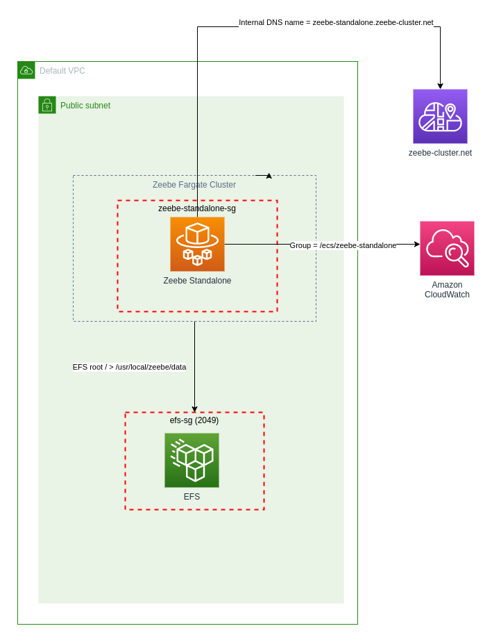
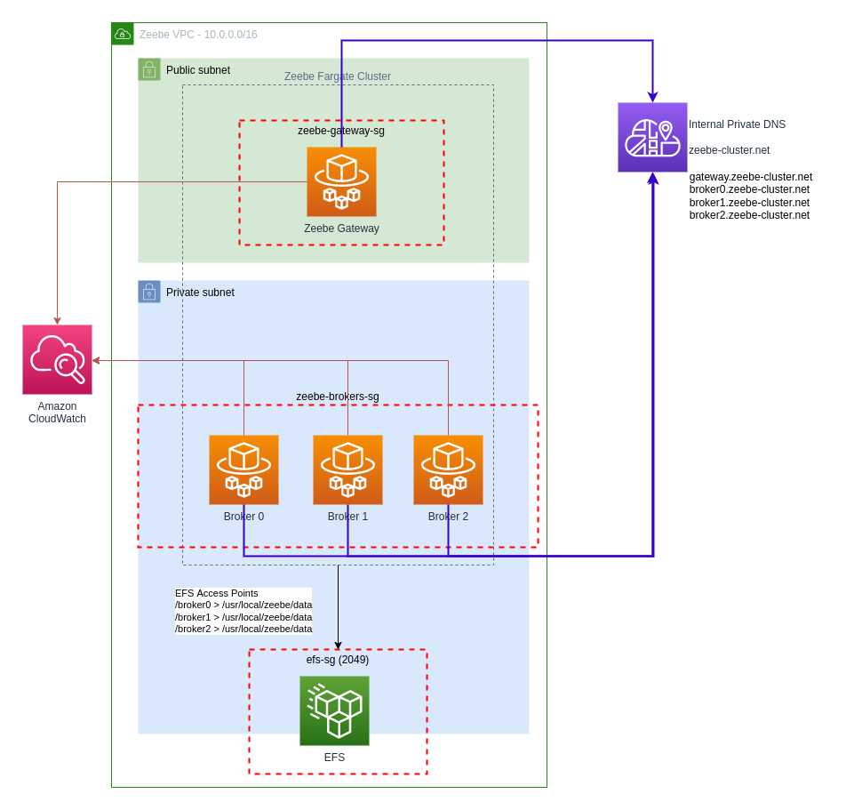
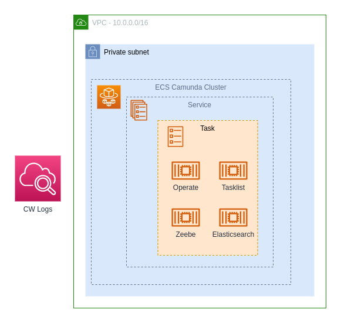

# Zeebe CDK Constructs

This is a library of CDK constructs and patterns for deploying the Camunda Zeebe workflow engine on AWS.

[](https://constructs.dev/packages/zeebe-cdk-constructs)

## Standalone Fargate



`ZeebeStandaloneFargateCluster` creates a single Zeebe instance that is configured as both gateway and broker, deployed
as Fargate service in a public subnet. With some additonal configuration data can be stored on EFS and the Simple
Monitor application can be co-deployed.

With the default configuration settings, the following infrastructure will be created on AWS:

* A vpc is required - default VPC can be used
* ECS Cluster - zeebe-standalone
* 1 Fargate task is created with 0.5 cpu and 1024 memory
* 1 Zeebe gateway/broker in a public subnet (Public IP4)
* Zeebe node is configured as a Fargate task definition and service
* Ephemeral task storage is mounted at /usr/local/zeebe/data (EFS is an option for persistent storage)

Note that a public subnet is used to make the initial setup and verification easier. You should secure the environment
with an appropriate security group configuration and/or move the deployment into a private vpc subnet.

```typescript

import * as cdk from 'aws-cdk-lib';
import {Construct} from 'constructs';
import {ZeebeStandaloneFargateCluster} from "zeebe-cdk-constructs";

export class ZeebeStandaloneFargateStack extends cdk.Stack {

    constructor(scope: Construct, id: string, props?: cdk.StackProps) {
        super(scope, id, props);

        let vpc = Vpc.fromLookup(this, 'my-vpc', {isDefault: true})

        new ZeebeStandaloneFargateCluster(this, 'ZeebeStandalone', {
            vpc: vpc,
            //
            // publicGateway: false, // Deploy the gateway in a private subnet 
            // Optional - EFS for persistent storage
            //fileSystem: new FileSystem(this, 'zeebe-efs', { vpc: vpc })
        });
    }
}

```

## Deploying Simple Monitor with Zeebe

The Simple monitor application can be deployed alongside the Zeebe instance using the configuration below.

* A custom Zeebe image that includes the Hazelcast exporter will be built and stored in ECR of the AWS account.
* This configuration will create a larger Fargate task using 2Gb of memory - split evenly between the Zeebe and Simple
  Monitor containers

```typescript

import * as cdk from 'aws-cdk-lib';
import {Construct} from 'constructs';
import {ZeebeStandaloneFargateCluster} from "zeebe-cdk-constructs";

export class ZeebeStandaloneFargateStack extends cdk.Stack {

    constructor(scope: Construct, id: string, props?: cdk.StackProps) {
        super(scope, id, props);

        new ZeebeStandaloneFargateCluster(this, 'ZeebeStandaloneWithSimpleMonitor', {
            simpleMonitor: true,
            hazelcastExporter: true
        });
    }
}

```

## Zeebe Fargate Cluster



The `ZeebeFargateCluster` will create the following infrastructure on AWS

With the default configuration, the following infrastructure will be created on AWS:

* New VPC on CIDR 10.0.0.0/16
* 1 NAT Gateway
* 3 Zeebe brokers in a private subnet (IP4)
* 1 Zeebe gateway in a public subnet (Public IP4)
* ECS Cluster
* Each Zeebe node is configured as a Fargate service
* Each Zeebe Fargate task is assigned 0.5 cpu and 1024 memory
* Cloud Map for internal DNS _zeebe-cluster.net_
* EFS with mount points for Zeebe data storage

Using the properties object you can customise the VPC settings, ECS cluster, security groups and Zeebe properties

```typescript
import * as cdk from 'aws-cdk-lib';
import {Construct} from 'constructs';
import {ZeebeFargateCluster} from "zeebe-cdk-constructs";


export class ZeebeFargateClusterStack extends cdk.Stack {

    constructor(scope: Construct, id: string, props?: cdk.StackProps) {
        super(scope, id, props);

        new ZeebeFargateCluster(this, 'ZeebeCluster', {
            // cpu: 512,                //Broker task cpu
            // memory: 1024,            //Broker task memory
            // gatewayCpu: 512,             
            // gatewayMemory: 1024,
        });
    }
}

```

### Customise Cluster Settings

```typescript
export class ZeebeFargateClusterStack extends cdk.Stack {

    constructor(scope: Construct, id: string, props?: cdk.StackProps) {
        super(scope, id, props);

        const myCustomVpc = Vpc.fromLookup(this, 'default', {vpcName: 'my-custom-vpc', vpcId: '1234'})

        new ZeebeFargateCluster(this, 'ZeebeCluster', {
            vpc: myCustomVpc,
            publicGateway: false //keep gateway internal, may need a vpn or bastion/jump server for access
        });
    }
}

```

## Camunda Core Simple



A construct pattern to create a Camunda 8 cluster comprising of Zeebe, Operate, Tasklist and Elasticsearch deployed on
AWS ECS Fargate.

The simple version creates all components within a single Fargate task definition and service. This simplifies the
networking as each component can refer to other components using localhost/127.0.0.1 (instead of Cloud Map service
discovery) - this approach is also cheaper. The drawback is a lack resilience as if one component fails, then the entire
task may need to be restarted, which will restart all components, as this construct is best used to spin up development
or testing environments

* Fargate task containing Zeebe, Operate, Tasklist, Elasticsearch
* The Fargate task by default is assigned 3gb memory and 1 cpu

```typescript
export class CamundaCoreSimpleStack extends cdk.Stack {

    constructor(scope: Construct, id: string, props?: cdk.StackProps) {
        super(scope, id, props);

        //This will create a new VPC and ECS cluster
        new CamundaPlatformCoreSimple(this, 'camunda-simple-fargate', {useEfsStorage: true});
    }
}
```

## Camunda Core (experimental - work in progress)

Deploys Zeebe, Camunda Operate, Camunda This construct aims to deploy the equivalent components of the camunda core
docker compose file on AWS Fargate.

* New VPC on CIDR 10.0.0.0/16
* 1 NAT Gateway
* 3 Zeebe brokers in a private subnet
* 1 Zeebe gateway is in a public subnet
* ECS Cluster
* Each Zeebe node is configured as a Fargate service
* Cloud Map for internal DNS _zeebe-cluster.net_
* EFS with mount points for Zeebe data storage

```typescript
export class CamundaCoreStack extends cdk.Stack {

    constructor(scope: Construct, id: string, props?: cdk.StackProps) {
        super(scope, id, props);

        const myCustomVpc = Vpc.fromLookup(this, 'default', {vpcName: 'my-custom-vpc', vpcId: '1234'})

        new CamundaPlatformCoreFargate(this, 'camunda-core', {
            vpc: myCustomVpc,
            publicGateway: false //keep gateway internal, may need a vpn or bastion/jump server for access
        });
        //loadbalancer url for tasklist and operate will be available as an output
    }
}
```

